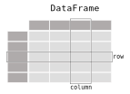

# pandas

Doing stuff with (tabular) data. 

Pandas is built on top of [numpy](https://numpy.org/), making use of its array
for implementing its data objects. 


## Installation

* Linux

  ```bash
  python3 -m venv venv
  ./venv/bin/pip install pandas matplotlib dask
  ```
  
* Windows

  ```commandline
  python -m venv venv
  .\venv\Scripts\pip install pandas matplotlib dask
  ```

## Datasets

The following datasets were used for the scripts below:

* [Dogs](data/Dog.LINK)
* [NZ Vehicle Database](data/Fleet30Nov2017.LINK)


## Scripts

Pandas can load lots of different types of data (`read_...`; like CSV, MS Excel, SQL, HDF5, JSON, XML, ...).

The main data structure in pandas is `DataFrame`, which is used for tabular data:



* [load_data.py](load_data.py)
* [load_large_data.py](load_large_data.py)
* [dogs_unique_breeds.py](dogs_unique_breeds.py)
* [dogs_breed_dist.py](dogs_breed_dist.py)
* [dogs_breed_dist_per_suburb.py](dogs_breed_dist_per_suburb.py)
* [dogs_offence_free.py](dogs_offence_free.py)


## Useful links

* [Getting started](https://pandas.pydata.org/pandas-docs/stable/getting_started/)
* [API](https://pandas.pydata.org/pandas-docs/stable/reference/api/)
* [Cheat sheet](https://pandas.pydata.org/Pandas_Cheat_Sheet.pdf)
* [csvkit](https://csvkit.readthedocs.io/)
